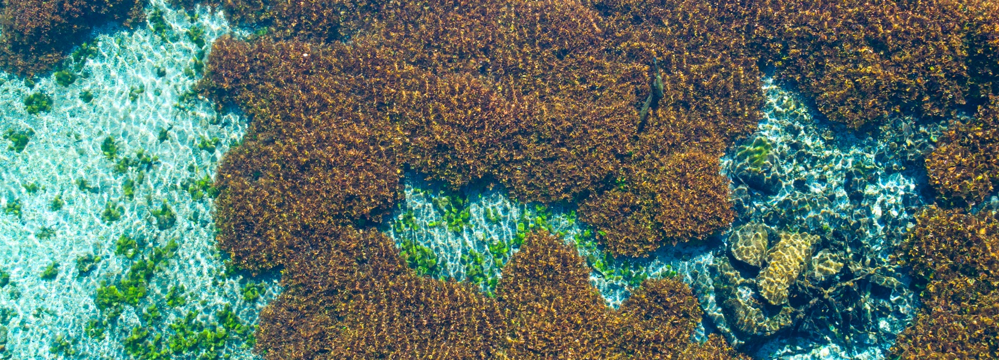

::: {.hero-full}
{.hero-img}

<div class="hero-overlay">
  April 15, 2026 · 9:00 – 3:00<br>
  LBJ Student Center, Room 323 · Texas State University · San Marcos, TX
</div>
:::

<div class="hero-below">

**Free Event – Lunch Provided · RSVP:** [kkollaus@edwardsaquifer.org](mailto:kkollaus@edwardsaquifer.org)

[Download full program (PDF)](img/Apr 2026 SC Program.pdf){.btn .btn-primary}

[Download Abstracts (PDF)](img/Apr 2026 SC Abstracts.pdf){.btn .btn-primary}
</div>

## Program {#program}

The list below shows all scheduled talks. Abstracts will be added as they are finalized.

```{=html}
<table class="talk-table">
  <thead>
    <tr>
      <th>Presenter</th>
      <th>Affiliation</th>
      <th>Session</th>
      <th>Title</th>
      <th>Abstract</th>
    </tr>
  </thead>
  <tbody>
    <tr>
      <td>Chad Furl, Ph.D. P.E.</td>
      <td>Edwards Aquifer Authority</td>
      <td>State of the Springs</td>
      <td>Opening Remarks</td>
      <td>
        <details class="abstract-details">
          <summary>Read abstract</summary>
          <div class="abstract-text">
            Opening remarks
          </div>
        </details>
      </td>
    </tr>

    <tr>
      <td>Paul Bertetti, P.G.</td>
      <td>Edwards Aquifer Authority</td>
      <td>State of the Springs</td>
      <td>Edwards Aquifer Hydrological update</td>
      <td>
        <details class="abstract-details">
          <summary>Read abstract</summary>
          <div class="abstract-text">
            Hydrological update
          </div>
        </details>
      </td>
    </tr>

    <tr>
      <td>Christa Kunkel, M.S.</td>
      <td>Bio-West, Inc.</td>
      <td>State of the Springs</td>
      <td>Springs Biological update</td>
      <td>
        <details class="abstract-details">
          <summary>Read abstract</summary>
          <div class="abstract-text">
            Biological update
          </div>
        </details>
      </td>
    </tr>

    <tr>
      <td>Hakan Başağaoğlu, Ph.D.</td>
      <td>Edwards Aquifer Authority</td>
      <td>Edwards Hydrology</td>
      <td>AI-derived recharge estimates to the Edwards Aquifer</td>
      <td>
        <details class="abstract-details">
          <summary>Read abstract</summary>
          <div class="abstract-text">
            We present a serial hybrid eXplainable Artificial Intelligence (XAI) framework that leverages U.S. Geological Survey (USGS) recharge estimates to train and evaluate XAI model predictive performance. Applied to two Edwards Aquifer basins, the XAI model accurately reproduced USGS recharge estimates and effectively captured high- and low-recharge events. The XAI model predicted three subtle recharge events in the Bexar basin test dataset that were not captured by the USGS approach. These predictions were corroborated by independent hydroclimatic measurements, HSPF simulations, and GRACE groundwater storage anomalies. SHapley Additive exPlanations (SHAP) revealed basin-specific recharge drivers: antecedent soil moisture dominated in the Nueces basin with perennial streams, whereas current-month precipitation was the primary driver in the Bexar basin with small ephemeral streams. Each driver explained ~32% of the variability in recharge estimates. SHAP further enabled probabilistic identification of hydroclimatic conditions favorable for enhanced recharge. Climate projections under CMIP6 scenarios indicate declining large recharge events through 2100, highlighting potential long-term groundwater sustainability risk.
          </div>
        </details>
      </td>
    </tr>

    <tr>
      <td>Debaditya Chakraborty, Ph.D.</td>
      <td>University of Texas at San Antonio</td>
      <td>Edwards Hydrology</td>
      <td>Short-term AI-based springflow predictions at Comal and San Marcos springs</td>
      <td>
        <details class="abstract-details">
          <summary>Read abstract</summary>
          <div class="abstract-text">
            Abstract pending.
          </div>
        </details>
      </td>
    </tr>
    
    <tr>
      <td>Changbing Yang, Ph.D. P.G.</td>
      <td>Edwards Aquifer Authority</td>
      <td>Edwards Hydrology</td>
      <td>Quantifying Recharge Basin Contributions to Springflow in a Karst Aquifer using Soluble Transport Modeling</td>
      <td>
        <details class="abstract-details">
          <summary>Read abstract</summary>
          <div class="abstract-text">
            This study applies a solute‐transport modeling framework to quantify the contributions of major recharge basins to springflow in the Edwards Balcones Fault Zone Aquifer (EBFZA). The analysis focuses on two key questions: (1) What percentage of springflow at Comal and San Marcos Springs originates from each recharge basin? (2) What percentage of recharge within each basin ultimately contributes to the flows of these springs? The modeling approach was first tested using synthetic cases and then applied to the EBFZA. Preliminary results suggest that Comal Springs is mainly supported by recharge from the Nueces and Frio Basins, whereas San Marcos Springs is primarily sustained by recharge from the Blanco and Comal–Dry Comal–Cibolo Basins. The accuracy of these estimates depends on the underlying groundwater flow model. Ongoing work will incorporate additional constraints, such as groundwater chemistry and isotopic data, to further improve the approach.
          </div>
        </details>
      </td>
    </tr>

    <tr>
      <td>Tyson McKinney, M.S.</td>
      <td>Austin Watershed Protection Department</td>
      <td>Edwards Hydrology</td>
      <td>Determining Post-Storm Wait Times to Ensure Baseflow Conditions for Water-Quality Sampling: A Case Study from the Edwards Aquifer, Central Texas.</td>
      <td>
        <details class="abstract-details">
          <summary>Read abstract</summary>
          <div class="abstract-text">
            Austin Watershed Protection (AWP) collects quarterly baseflow geochemical samples from six springs in the Barton Springs Segment of the Edwards Aquifer for regulatory compliance and long-term trend analyses. Historically, surface water protocols have guided post-storm wait times for sampling, though preliminary data suggest that those wait times are insufficient to ensure baseflow conditions for several of the springs. This study uses continuous specific conductivity data and Gage Adjusted Radar Rainfall (GARR) to calculate wait times for each spring following storms of different magnitude. Preliminary results indicate wait times ranging from 7 hours to more than 7 days. Continuous monitoring will continue until data have been collected for at least two years each under low (<40 cfs), medium (40-80 cfs), and high (>80 cfs) discharge conditions, defined by the cumulative flow from the Barton Springs complex. Thus far, all analysis for this study has occurred under low discharge conditions. 
          </div>
        </details>
      </td>
    </tr>

    <tr>
      <td>Ben Hutchins, Ph.D.</td>
      <td>Texas State University - Edwards Aquifer Research and Data Center</td>
      <td>Data Repositories</td>
      <td>The Aquifer Biodiversity Collection at the Edwards Aquifer Research and Data Center</td>
      <td>
        <details class="abstract-details">
          <summary>Read abstract</summary>
          <div class="abstract-text">
            Occurrence records serve as the basis for ecological studies and inform conservation and management decisions. Curated specimens are the gold standard for occurrence records, facilitating verification of published data and generation of novel information (e.g., new occurrence records and genetic or demographic data). Groundwater-obligate invertebrates feature prominently on Texas’ state and federal protected species lists, highlighting the need for high-quality occurrence data. Since the 1970s, Texas State University has maintained a substantial groundwater invertebrate collection and now serves as the primary repository for new material. Collections data, however, were not digitized, limiting their utility. With a grant from Texas Parks and Wildlife, over 10,000 specimens from around the state have now been databased and made available online. The database includes over 52 ‘species of greatest conservation need’ from over 251 locations. With anticipated annual growth of approximately 1000 lots, the collection will be an important component of future database projects supporting researchers and resource managers.
          </div>
        </details>
      </td>
    </tr>

    <tr>
      <td>Bryan Anderson, M.S.</td>
      <td>Edwards Aquifer Authority</td>
      <td>Data Repositories</td>
      <td>The Edwards Aquifer Authority Environmental Data Portal</td>
      <td>
        <details class="abstract-details">
          <summary>Read abstract</summary>
          <div class="abstract-text">
            Since its inception, the Edwards Aquifer Authority (EAA) has prioritized environmental data collection. What began with a small number of analog chart recorders measuring continuous groundwater levels has evolved into a robust monitoring network of over 160 sites across the Edwards Aquifer region. The network collects high frequency measurements of groundwater levels, water quality parameters, precipitation, and meteorological variables from wells, springs, streams, rain gauges, and weather stations. While these data have long been available by request, the EAA Environmental Data Portal was launched in Spring 2025 to provide streamlined, on-demand public access to these datasets. The portal features interactive maps, detailed site information, and data downloads for EAA managed monitoring sites, along with links to additional hydrologic data sources for the area. The Environmental Data Portal is designed to facilitate scientific analysis, long-term trend evaluation, and resource management decision making by improving data accessibility and transparency.
          </div>
        </details>
      </td>
    </tr>

    <tr>
      <td>Pete Diaz, M.S.</td>
      <td>U.S. Fish and Wildlife Service</td>
      <td>HCP Biology</td>
      <td>Occupancy and Site Level Estimates of Abundance for the San Marcos Salamander (Eurycea nana)</td>
      <td>
        <details class="abstract-details">
          <summary>Read abstract</summary>
          <div class="abstract-text">
            Abstract pending.
          </div>
        </details>
      </td>
    </tr>

    <tr>
      <td>Nate Bendik</td>
      <td>Austin Watershed Protection Department</td>
      <td>HCP Biology</td>
      <td>Restoration of Spring-Run Habitat Improves Abundance and Juvenile Survival for Endangered, Highly Endemic Salamanders.</td>
      <td>
        <details class="abstract-details">
          <summary>Read abstract</summary>
          <div class="abstract-text">
            Habitat loss and degradation are leading causes of extinction and endangerment for species worldwide. The goal of habitat restoration is to reverse habitat loss and improve the probability for species to persist. Barton Springs salamanders inhabit both surface and subterranean waters, but most of the latter is inaccessible for restoration. Of their surface habitat, almost all of it has been modified or destroyed by regular disturbance and constructed impoundments within and around the springs. In accordance with a Habitat Conservation Plan, the City of Austin restored a 21 m spring run (buried for almost 100 years) to expand habitat for endangered salamanders. Using data from an 8-year capture-recapture study, we examined changes in abundance, survivorship, and movement affiliated with the existing and newly created habitats. We documented improvements in several population metrics, including a dramatic increase in carrying capacity at the site.
          </div>
        </details>
      </td>
    </tr>

    <tr>
      <td>Chris Riggins, M.S.</td>
      <td>Texas State University - The Meadows Center for Water and the Environment</td>
      <td>HCP Biology</td>
      <td>Control Enhancement Research of Suckermouth Armored Catfish</td>
      <td>
        <details class="abstract-details">
          <summary>Read abstract</summary>
          <div class="abstract-text">
            Since 2013, the Edwards Aquifer Habitat Conservation Plan includes the targeted removal of invasive suckermouth armored catfish (SAC; Loricariidae) in the San Marcos River, aimed at reducing impacts to the critical habitat of federally protected species. This year, those efforts are set to reach over 20,000 SAC removed from the river. Alongside removal efforts, a decade of research has provided insight into SAC population dynamics, movement, behavior, and spatial distribution within the river. Studies have evaluated biomass reduction through spearfishing efforts, documented dispersal using PIT tag technology, examined population structure during dewatering events, and estimated abundance using underwater camera surveys. These efforts have informed Best Management Practices by identifying predictable behavioral patterns, dispersal potential, and habitat preferences that improve removal activities. Continued integration of monitoring and adaptive management is helping refine suppression strategies and move management closer to the goal of functional eradication of SAC within the San Marcos River.
          </div>
        </details>
      </td>
    </tr>

    <tr>
      <td>Austin Davis, M.S.</td>
      <td>San Antonio River Authority</td>
      <td>HCP Biology</td>
      <td>Apple Snails: Big Snail, Even Bigger Problem</td>
      <td>
        <details class="abstract-details">
          <summary>Read abstract</summary>
          <div class="abstract-text">
            Abstract pending.
          </div>
        </details>
      </td>
    </tr>
  </tbody>
</table>

```

<h2 id="logistics">Logistics</h2> <p> <strong>Date &amp; Time</strong><br> April 15, 2026 &middot; 9:00 AM – 3:00 PM </p> <p> <strong>Location</strong><br> LBJ Student Center, Room 323<br> Texas State University &middot; San Marcos, Texas </p> <p> <strong>Check-in</strong><br> Check-in and name badges available outside Room 323 starting at 8:30 AM. </p> <p> <strong>Food &amp; breaks</strong><br> Morning and afternoon coffee breaks are provided.<br> Lunch is provided for all registered attendees. </p> <p> <strong>Parking</strong><br> Please see parking maps at the link below.  The LBJ Student Center is immediately adjacent to the
LBJ Parking garage.  Directions to the parking garage are available on Google and Apple maps.<br> <br>  Please bring your parking ticket to meeting, we will validate. </p> 


<p> <a href="img/Parking.pdf" class="btn btn-secondary"> Download parking map (PDF) </a> </p>

